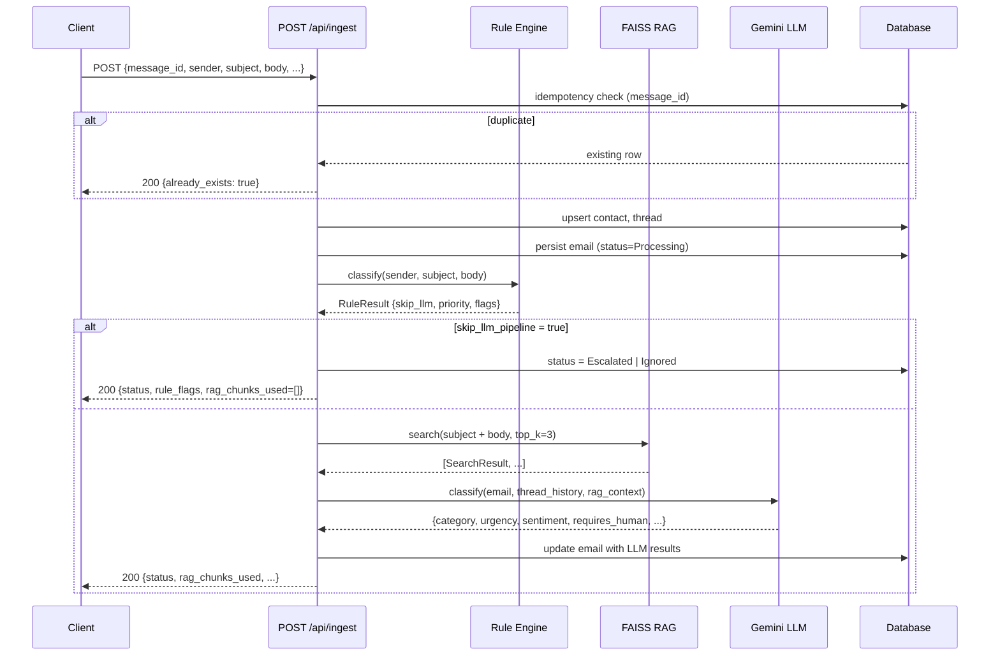
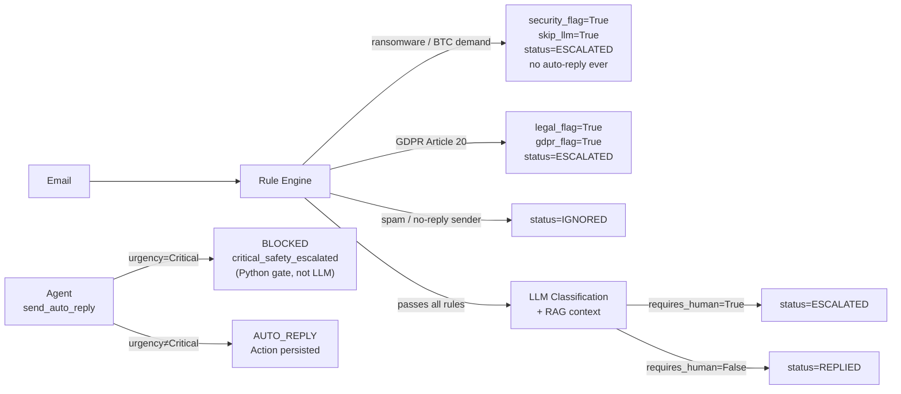

# SenAI CRM — Architecture Diagram

## Full System Flow

```mermaid
flowchart TD
    subgraph INPUT["Email Input"]
        SIM["Stream Simulator\nemail-data-advanced.json\n(60 emails, configurable rate)"]
        EXT["External Client\n(POST /api/ingest)"]
    end

    subgraph INGEST["Ingest Pipeline  POST /api/ingest"]
        DEDUP["Idempotency Check\nmessage_id UNIQUE"]
        CONTACT["Upsert Contact"]
        THREAD["Upsert Thread"]
        PERSIST["Persist Email Row"]
        RULE["Rule Engine\n(deterministic gate)"]
    end

    subgraph GATE{"Safety Gate\nskip_llm_pipeline?"}
        HARD_STOP["Hard Stop\nransomware → ESCALATED\nspam → IGNORED\nlegal/GDPR → ESCALATED"]
    end

    subgraph LLM_LAYER["LLM Classification Layer"]
        RAG_SEARCH["RAG Search\nFAISS IndexFlatIP\n(cosine similarity, top-3)"]
        CLASSIFY["ClassificationService\nGemini 2.0 Flash\n(JSON mode, temp=0.1)"]
        KB[("Knowledge Base\n6 .md files\nchunked + embedded\nall-MiniLM-L6-v2\n384-dim vectors")]
    end

    subgraph AGENT_LAYER["Agent Orchestrator  POST /agent/run/{id}"]
        REACT["ReAct Loop\nThought → Action → Observation\nmax 6 steps"]
        TOOLS["Tools\nsearch_knowledge_base\nget_thread_history\nget_contact_profile\ncheck_account_status\ndraft_reply\nescalate_to_human\ncreate_internal_ticket\nflag_for_legal\nsend_auto_reply\nscrape_public_sentiment"]
        SAFETY["Critical Safety Gate\nurgency=Critical\n→ force escalate_to_human\n(deterministic Python,\nnever LLM-dependent)"]
        WEB_INTEL["Web Intelligence\nG2 + Trustpilot\nrobots.txt check\n6hr cache"]
    end

    subgraph DB["Database  SQLite / PostgreSQL"]
        EMAILS[("emails")]
        THREADS[("threads")]
        CONTACTS[("contacts")]
        ACTIONS[("actions\nagent_reasoning_log JSON")]
        CHUNKS[("knowledge_chunks\nembedding JSON")]
        WEB_CACHE[("web_intelligence_cache\n6hr TTL")]
        AUDIT[("audit_log")]
    end

    subgraph FRONTEND["Frontend  React + Vite + Tailwind"]
        INBOX["Inbox View\nsortable table\nsentiment badges\ntab filters\n10s polling"]
        WORKSPACE["Thread Workspace\nemail body + entity highlights\nthread timeline\ncontact card\nagent trace\nRAG chunks panel\naction buttons"]
        ANALYTICS["Analytics View\nsentiment trend chart\ncategory breakdown\nat-risk accounts"]
    end

    SIM -->|"POST /api/ingest"| DEDUP
    EXT -->|"POST /api/ingest"| DEDUP
    DEDUP -->|"new"| CONTACT
    DEDUP -->|"duplicate → 200 already_exists=true"| DEDUP
    CONTACT --> THREAD --> PERSIST --> RULE

    RULE -->|"skip_llm_pipeline=true"| GATE
    GATE --> HARD_STOP

    RULE -->|"skip_llm_pipeline=false"| RAG_SEARCH
    RAG_SEARCH <-->|"embed query\ncos-sim search"| KB
    KB <-->|"chunk_text + embedding"| CHUNKS
    RAG_SEARCH -->|"rag_context (top-3 chunks)"| CLASSIFY
    CLASSIFY -->|"category, urgency,\nsentiment, requires_human"| PERSIST

    PERSIST --> EMAILS
    CONTACT --> CONTACTS
    THREAD --> THREADS

    EMAILS -->|"email_id"| REACT
    REACT <--> TOOLS
    TOOLS -->|"search_knowledge_base"| KB
    TOOLS -->|"get_thread_history"| THREADS
    TOOLS -->|"get_contact_profile\ncheck_account_status"| CONTACTS
    TOOLS -->|"flag_for_legal\ncreate_internal_ticket"| ACTIONS
    TOOLS -->|"scrape_public_sentiment"| WEB_INTEL
    WEB_INTEL <-->|"cache lookup / write"| WEB_CACHE
    REACT --> SAFETY
    SAFETY -->|"terminal action\n(escalate / auto_reply / FINISH)"| ACTIONS
    ACTIONS -->|"agent_reasoning_log\n(full ReAct trace)"| AUDIT

    EMAILS --- FRONTEND
    THREADS --- FRONTEND
    CONTACTS --- FRONTEND
    ACTIONS --- FRONTEND
    CHUNKS --- FRONTEND

    INBOX -->|"GET /api/emails\n10s poll"| EMAILS
    WORKSPACE -->|"GET /api/emails/{id}"| EMAILS
    WORKSPACE -->|"GET /threads/{email}"| THREADS
    WORKSPACE -->|"GET /contacts/{email}"| CONTACTS
    WORKSPACE -->|"GET /rag/search"| KB
    ANALYTICS -->|"GET /analytics/*\nGET /dashboard/stats"| EMAILS
```

---

## Component Responsibilities

| Component | Technology | Responsibility |
|---|---|---|
| Stream Simulator | Python + httpx | Replay dataset through ingest endpoint at configurable rate |
| Rule Engine | Pure Python regex/keyword | Deterministic hard-stop gate — runs before any LLM call |
| RAG Service | FAISS + sentence-transformers | Embed query, retrieve top-k KB chunks by cosine similarity |
| ClassificationService | Gemini 2.0 Flash | Structured JSON classification with RAG context injected |
| AgentOrchestrator | Custom ReAct loop | Multi-step reasoning over 10 tools, max 6 steps, safety gate |
| Web Intelligence | httpx + robots.txt check | Live G2/Trustpilot scraping with 6hr DB cache + mock fallback |
| FastAPI backend | FastAPI + SQLAlchemy | 19 REST endpoints, dependency injection, Alembic migrations |
| React frontend | React + Vite + Tailwind + recharts | Three-view ops tool: Inbox, Thread workspace, Analytics |

---

## Data Flow: Ingest → Classification → Agent



---

## Safety Gate Logic


